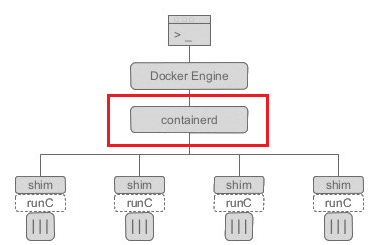
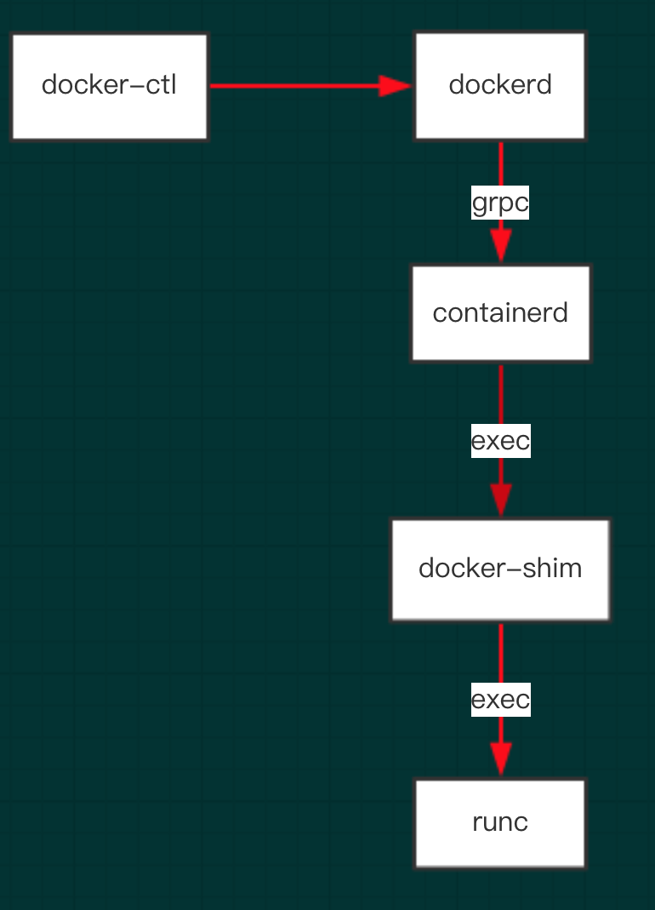

# Introduction of containerd
The containerd is An industry-standard container runtime which can manage the complete container lifecycle of its host system: image transfer and storage, container execution and so on. The containerd is also can directly be used by Kubernets CRI.

containerd is designed to be embedded into a larger system, rather than being used directly by developers or end-users like the following pictures:

By the way, the procedure of container execution is not run by the containerd but the RunC. See the following pictures of docker constructure:

Now we can see in docker, container management and operation is done by containerd. Calling RunC to do container execution is one of its jobs.

# Introduction of RunC
The runc is a CLI tool for spawning and running containers according to the OCI specification. In docker or Containerd, it is created by containerd-shim which is called by containerd. The containerd-shim is the father process of runc.

