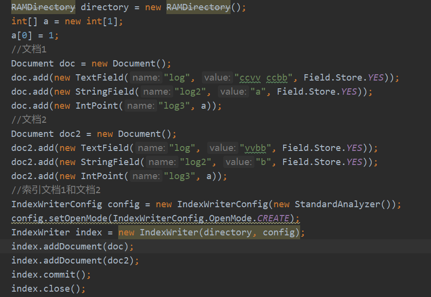
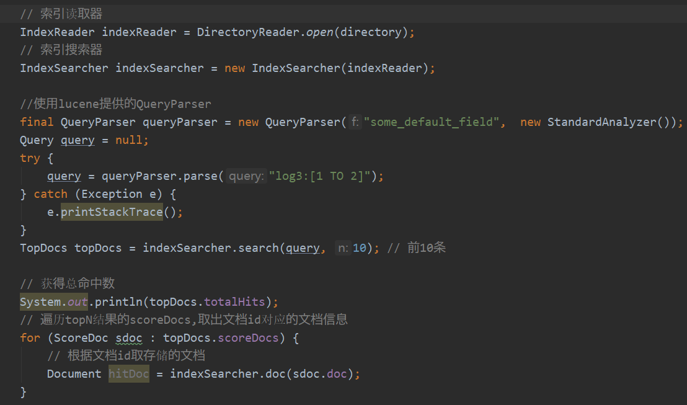
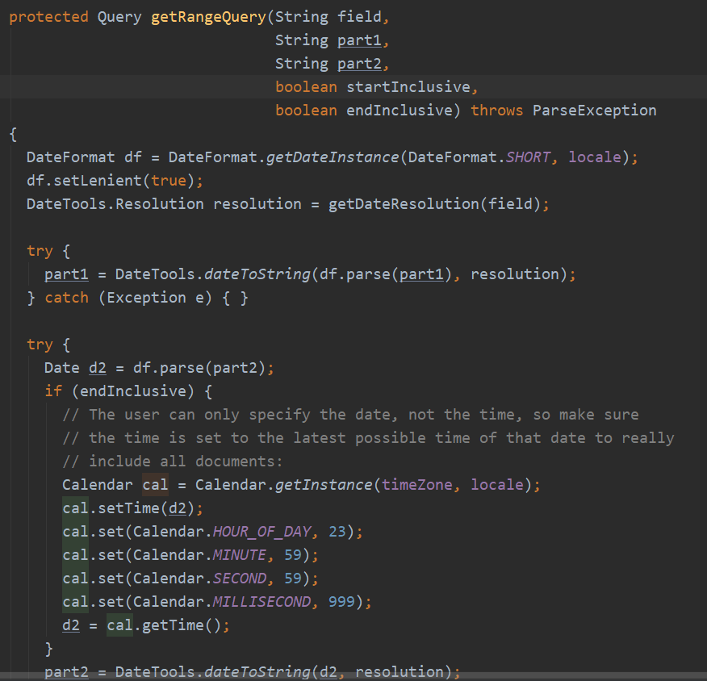
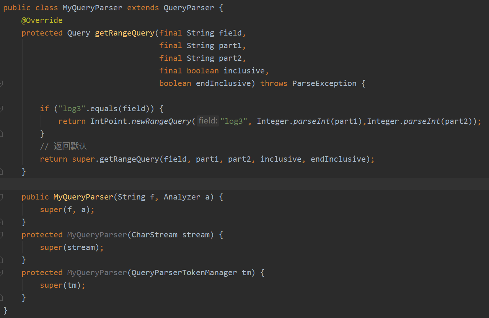
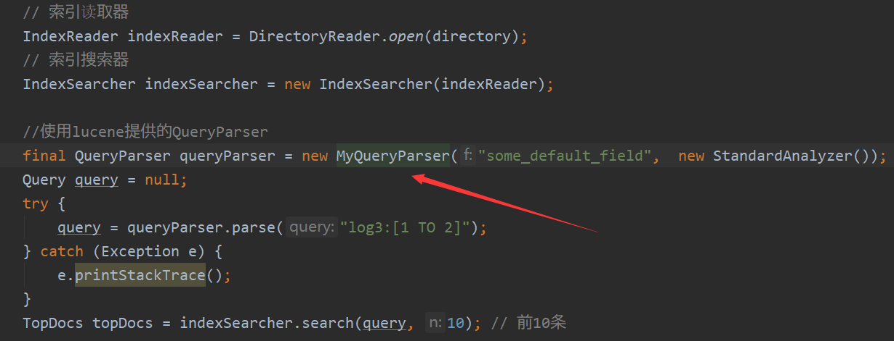

## What's the problem
In lucene, QueryParser is useless for the numeric type. Here let's an example:

first of all, we index 2 documents:

Then use do range search for log3 with the range of [1,2].

finally, we found both the 2 documents can not be searched.

## Source of the Problem
from the source code we will know that:
(1) QueryParser extends QueryParserBase which is an abstract class.
    
    public class QueryParser extends QueryParserBase implements QueryParserConstants 

(2)In the parse function which is belonged to the QueryParser class, a range request will go into the getRangeQuery function of the QueryParser class.

    protected Query getRangeQuery(String field,String part1,String part2,boolean startInclusive,boolean endInclusive) throws ParseException

(3) in the getRangeQuery function:

we will find that:
- the field is what we will search
- part1 the	limit on the left
- part2 the	limit on the right

This function will create date format object first. if its type is the time then search it as a time type, or it will do is as its type is asii.

## Solution
We can use the chain of responsibility pattern to extend QueryParser and rewrite the GetRangeQuery method.

Like the following:

We rewrite the getRangeQuery method to implement the chain of responsibility pattern.

Then we can search is like:

In this way, the range search will go into the extending class MyQueryParser to do the search we need. and finally we will get what we want by searching log3.