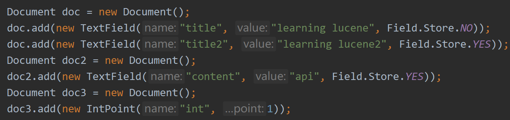
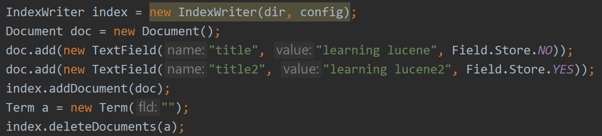

In Lucene, documents can be Inserted, Deleted, Updated and Searched.

# Inserting, Deleting, Updating of Documents
## Adding Document
We can do inserting like the following

Lucene allows add one or more ducuments through a IndexWriter instance.

## Deleting Document
We can do deleting like the following

We can deleting documents according to Term and Query.

## Updating Document
