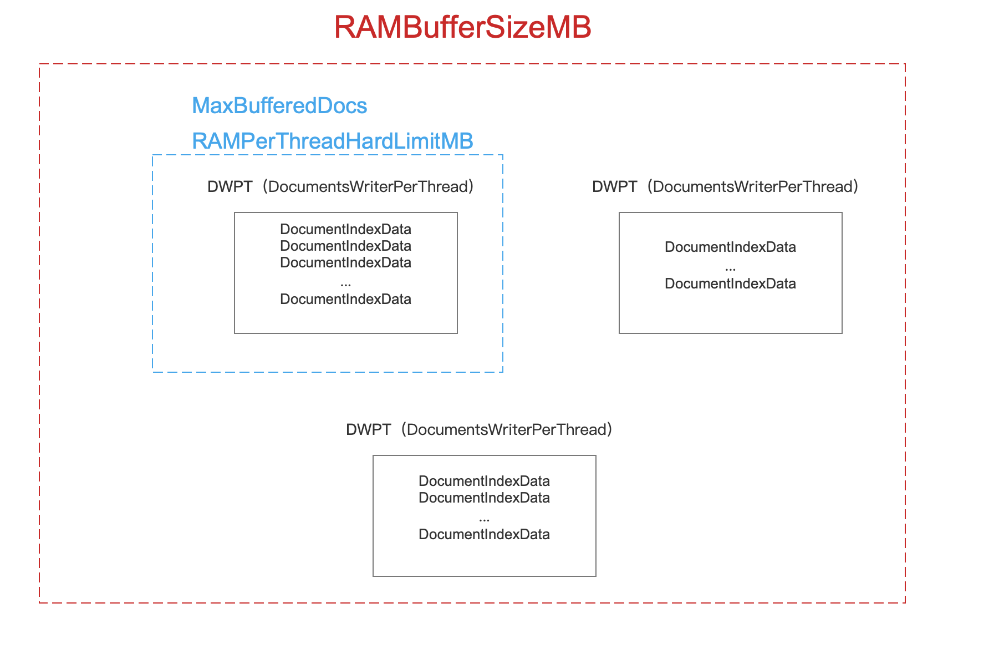

The series of IndexWriter documents will introduce how to construct a IndexWriter instance. There will be 3 parts ：

- set Directory
- set IndexWriterConfig
- call the Constructor of IndexWriter

In the chapter 1, we know the unmodifiable configuration of indexWriterConfig, now I will describe the modifiable configuration.

# Modifiable Configuration of IndexWriterConfig
There are 7 kinds:

- MergePolicy
- MaxBufferedDocs
- RAMBufferSizeMB
- MergedSegmentWarmer
- UseCompoundFile
- CommitOnClose
- CheckPendingFlushUpdate

# MergePolicy
MergePolicy describes how to find segment set that need to be merged. There are 2 kinds of policy:

- LogMergePolicy
- TieredMergePolicy

MergePolicy can use IndexWriterConfig.setMergePolicy(MergePolicy mergePolicy) to set. In Lucene7.5.0, the default policy is TieredMergePolicy. If the MergePolicy has changed, the next merging will use the new policy.

# MaxBufferedDocs and RAMBufferSizeMB
Sets the maximum memory consumption per thread triggering a forced flush if exceeded. A DocumentsWriterPerThread(DWPT) is forcefully flushed once it exceeds this limit even if the RAMBufferSizeMB has not been exceeded. This is a safety limit to prevent a DocumentsWriterPerThread from address space exhaustion due to its internal 32 bit signed integer based memory addressing. The given value must be less that 2GB (2048MB)

# MergedSegmentWarmer
MergedSegmentWarmer is used to get information before merging to get better performance. MergedSegmentWarmer can use IndexWriterConfig.setMergedSegmentWarmer(IndexReaderWarmer mergeSegmentWarmer)to set. The default MergedSegmentWarmer is null.

# UseCompoundFile
The UseCompoundFile is a boalean value. When it is true, then after doing flush or committing, the file type will be like .cfs or .cfe. UseCompoundFile can use IndexWriterConfig.setUseCompoundFile(boolean useCompoundFile) to set, the default UseCompoundFile is true.

# CommitOnClose
The CommitOnClose is a boalean value. When is it true, then it will apply all changing. CommitOnClose can use IndexWriterConfig.setCommitOnClose(boolean commitOnClose) to set, the default CommitOnClose value is true.

# CheckPendingFlushUpdate
The CheckPendingFlushUpdateis a boalean value. If it is true, atfter one thread is donw with files, it will try to flush DWPT.

