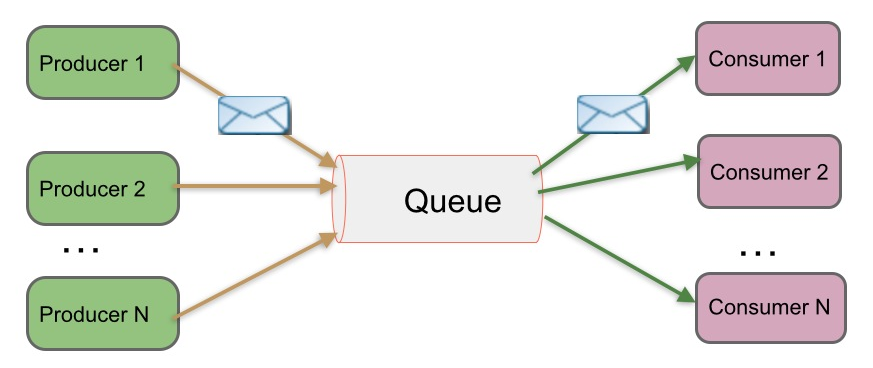
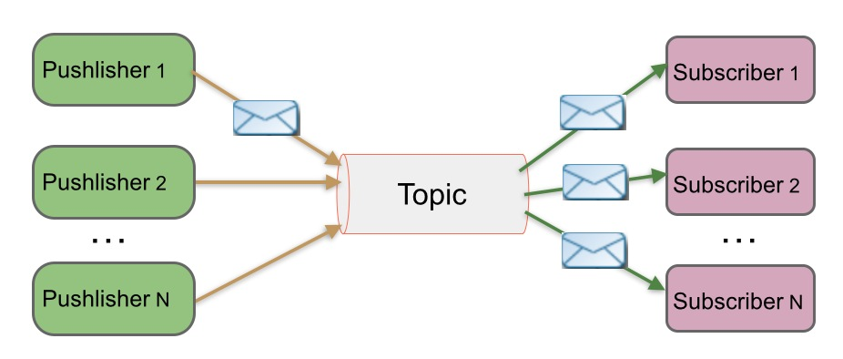

# Introduction of kafka
Apache Kafka is an open-source distributed event streaming platform used by thousands of companies for high-performance data pipelines, streaming analytics, data integration, and mission-critical applications.

## P2P Message
In the P2P Message system, message will be persistented in a queue. Every message just can be consumed onetime.

Oon producer send a message to the queue, and only one comsumer can get the message.

## Pub-Sub Message
In the P2P Message system, message will be persistented in a queue. Every message just can be consumed By all the comsumers(subscribers).

Oon producer send a message to the queue, and all comsumers(subscribers) can get the message.

## Components in Kafka Server
### Broker
Kafka is run as a cluster of one or more servers that can span multiple datacenters or cloud regions. Some of these servers form the storage layer, called the brokers. Other servers run Kafka Connect to continuously import and export data as event streams to integrate Kafka with your existing systems such as relational databases as well as other Kafka clusters. To let you implement mission-critical use cases, a Kafka cluster is highly scalable and fault-tolerant: if any of its servers fails, the other servers will take over their work to ensure continuous operations without any data loss.

### Topic
a topic is similar to a folder in a filesystem, and the events are the files in that folder. Topics in Kafka are always multi-producer and multi-subscriber: a topic can have zero, one, or many producers that write events to it, as well as zero, one, or many consumers that subscribe to these events. Events in a topic can be read as often as needed—unlike traditional messaging systems, events are not deleted after consumption. Instead, you define for how long Kafka should retain your events through a per-topic configuration setting, after which old events will be discarded. Kafka's performance is effectively constant with respect to data size, so storing data for a long time is perfectly fine.

### Partition
opics are partitioned, meaning a topic is spread over a number of "buckets" located on different Kafka brokers. This distributed placement of your data is very important for scalability because it allows client applications to both read and write the data from/to many brokers at the same time. When a new event is published to a topic, it is actually appended to one of the topic's partitions. Events with the same event key are written to the same partition, and Kafka guarantees that any consumer of a given topic-partition will always read that partition's events in exactly the same order as they were written.